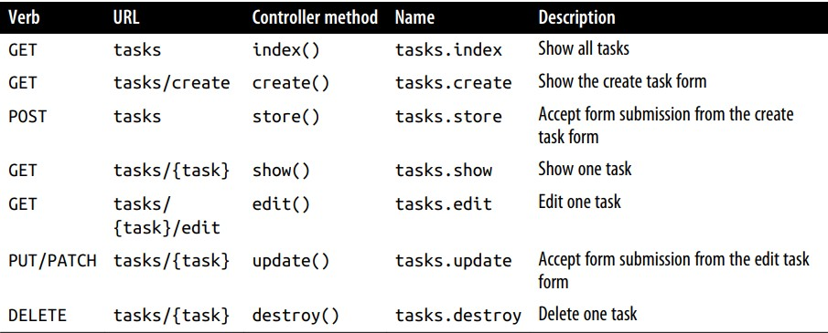

# REST (Representational State Transfer)

-  A RESTful API allows clients to interact with a server using standard HTTP methods, such as GET, POST, PUT, PATCH, and DELETE.

# MVC
## model
- individual database table
## view
- templates that outputs data to user
## controller
1. takes HTTP requests from browser
2. gets right data from databse
3. validate user input
4. send response back to user
## Explain how mvc works with user

1. user send http request via browser to controller
2. controller write/take data to/from the model
3. controller send data to view
4. the view will show data to user 

# HTTP verbs
1. get & post
2. put & delete
3. head, options & patch
4. trace & connect
- get: request resources
- head: version of get, ask for headers
- post: create resources
- put & patch: overwrite resources
- delete: delete resources
- options: ask server which verbs are allowed for that url

# closure
- anonymous function
-  A closure is a function that:
    -  you can pass around as an object
    -  assign to a variable
    -  pass as a parameter to other functions and methods
    -  serialize.

# middleware
- like middleman between application and browser or client
- middleware: check if the user is authoticated, validate input and modify response
- series of filters or actions that can be applied to the request and response.
- Each middleware does a specific task, such as checking if the user is logged in or compressing the response data.
- it can be defined in route or in controller
- often, it’s clearer and more direct to attach middleware to your routes in the controller instead of at the route definition. 
```php
Route::middleware('auth')->group(function() {
 Route::get('dashboard', function () {
 return view('dashboard');
 });
 Route::get('account', function () {
 return view('account');
 });
});

class DashboardController extends Controller
{
 public function __construct()
 {
 $this->middleware('auth');
 $this->middleware('admin-auth')
 ->only('editUsers');
 $this->middleware('team-member')
 ->except('editUsers');
 }
}
```

# laravel caching & closure function
- In Laravel, route caching is a feature that can significantly improve the performance of your application by precompiling and storing the routes in a cache file. This cache file allows Laravel to quickly determine which route corresponds to a given URL, without having to go through the process of registering and resolving routes for each request.
- However, when you use route closures (anonymous functions) to define your routes, Laravel cannot cache those routes. This means that for each request, Laravel needs to dynamically evaluate the routes and match them against the requested URL, which takes additional time and resources.
- On the other hand, when you define routes using named controller methods or controller invocations, Laravel can cache those routes. By caching the routes, Laravel can skip the route resolution process and directly retrieve the corresponding route from the cache file, resulting in a significant performance boost.

# Route Parameters
## optional parameter
- you can make parameters optional by adding ? after name of paramater
```php
Route::get('users/{id?}', function ($id = 'fallbackId') {
 //
});
```
## REGEX 
- you can use regex to make route accept only if the route match specific requirements
```php
Route::get('users/{id}', function ($id) {
 //
})->where('id', '[0-9]+');

Route::get('users/{username}', function ($username) {
 //
})->where('username', '[A-Za-z]+');

Route::get('posts/{id}/{slug}', function ($id, $slug) {
 //
})->where(['id' => '[0-9]+', 'slug' => '[A-Za-z]+']);

// note that {id} & $id and {slug} & $slug are not important to be the same, but it is preferred, it works from left to write
```
# ROUTE name
- it is better because it is easier
- if you change the route you will not change url in front end code
```php
// Defining a route with name() in routes/web.php:
Route::get('members/{id}', 'MembersController@show')->name('members.show');

// Linking the route in a view using the route() helper:
<a href="<?php echo route('members.show', ['id' => 14]); ?>">
```
## define middleware in controller or in route defination
- sometimes it is better to define middleware in controller rather than route defination
- in comlex apps it is better to define it in cotroller
```php
class DashboardController extends Controller
{
 public function __construct()
 {
 $this->middleware('auth');
 $this->middleware('admin-auth')
 ->only('editUsers');
 $this->middleware('team-member')
 ->except('editUsers');
 }
}
```
## rate limiting
- limit number of requests to access page in minute
- after using all the limits page will not accept any requests until you try again afer minute goes 
```php
//                                      n  m
Route::middleware('auth:api', 'throttle:60,1')->group(function () {
 Route::get('/profile', function () {
 //
 });
});
```
- you can pass variable form eloquent model to the throttle as the first paramater like that 
```php
//                                      n            m
Route::middleware(['auth', 'throttle:plan_rate_limit,1'])->group(function () {
    Route::get('/coco', function () {
    return 'welcome';
    });
});
```
# prief introduction to eloquent
- relate model with database table
```php
Post::all()
```
## query builder
```php
Post::where('active', true)->get(); 
DB::table('users')->all();
```
# Route fallback
- it is defined to return somthing if no route match
- it must be defiened at the end of the routes
```php
Route::fallback(function () {
    return 'That route is not found.';
});
```

# Route namespace
- i think that use `App\Http\Controllers\ProfileController` is nice also and easier
- make me write smaller route definations
```php
Route::middleware('auth')->namespace('App\Http\Controllers')->group(function () {
    Route::get('/profile', [ProfileController::class, 'edit'])->name('profile.edit');
    Route::patch('/profile', [ProfileController::class, 'update'])->name('profile.update');
    Route::delete('/profile', [ProfileController::class, 'destroy'])->name('profile.destroy');
});
```

# prefix & name
- make route defination easier
```php
Route::middleware('auth')->namespace('App\Http\Controllers')->name('profile.')->prefix('profile')->group(function () {
    Route::get('', [ProfileController::class, 'edit'])->name('edit');
    Route::patch('', [ProfileController::class, 'update'])->name('update');
    Route::delete('', [ProfileController::class, 'destroy'])->name('destroy');
});
```
# signed route
- make that email only valid for people who signed in 
  ex: if you try to reset password make that link only valid for that man who request to reset password
- “Sign” the link so that it uniquely proves that the user received the link from your email, without them having to log in; something like http://myapp.com/invitations/5816/yes?signature=030ab0ef6a8237bd86a8b8.
## signed urls
- this links are composed of normal link with signature which proves that url has not been changes since it was sent(and therefore that no one has modified the URL to access someone else’s information)

```php
use Illuminate\Support\Facades\URL;

$url = URL::signedRoute('mailing-list.confirm', ['user' => $userId]);
```
## signed route
- it is used to make sure that the user how access this mail is the one who already signed in only
- it send signature with the link
## steps to do it
1. generate signed url and the send invitation mail in web folder
```php
Route::middleware(['auth', 'throttle:60,1'])->group(function () {
    Route::get('/invitations/{invitation}/{answer}', [InvitationController::class, 'confirm'])
        ->name('invitations')
        ->middleware('signed');

    Route::get('/send-invitation-email', function () {
        $recipient = 'redasalma@std.mans.edu.eg';

        $url = URL::temporarySignedRoute('invitations', now()->addHours(4), [
            'invitation' => 12345,
            'answer' => 'yes',
        ]);

        Mail::to($recipient)->send(new InvitationEmail($url));

        return 'Invitation email sent successfully!';
    });
});
```
2. Create the Email Template
```php
@component('mail::message')
# Invitation to Join Our Mailing List

Click the button below to confirm your subscription:

@component('mail::button', ['url' => $url])
Confirm Subscription
@endcomponent

Thanks,
The Example Team
@endcomponent
```
3. genrate invetation mail
```php
namespace App\Mail;

use Illuminate\Bus\Queueable;
use Illuminate\Mail\Mailable;
use Illuminate\Queue\SerializesModels;

class InvitationEmail extends Mailable
{
    use Queueable, SerializesModels;

    public $url;

    public function __construct($url)
    {
        $this->url = $url;
    }

    public function build()
    {
        return $this->markdown('emails.invitation')
            ->subject('Invitation to join our mailing list');
    }
}
```
4. make Invetation controller
```php
namespace App\Http\Controllers;

use Illuminate\Http\Request;

class InvitationController extends Controller
{
    public function confirm(Request $request)
    {
        if (!$request->hasValidSignature()) {
            abort(403, 'Invalid or expired signature');
        }
        return 'Thank you for confirming!';
    }
}
```
5. if you don't make mailgun configration make it if you forget how to make it see video 61 & 62 

# VIEW share data
- it is hustle to share same data in every view
- so there is a helper function to share data in all views or some specific views you define
- that helper is `share`
```php
view()->share('variableName', 'variableValue');
```

# resources controller in api 
- that is diffrent from that with HTML resource controller because it doesn't contain create or edit
```cmd
php artisan make:controller MySampleResourceController --api
```
- in web or api folder
```php
Route::apiResource('tasks', 'TasksController');
```

# single action controller
- the _invoke method in php invoke instance of class and let you treat with that instance as a function
- we wil use it if we have a contoller doing only one functionality
```php
namespace App\Http\Controllers;

class SayHello extends Controller
{
    public function __invoke(){
        return 'Hello man <3';
    }
}

// routes/web.php
Route::get('sayHello',SayHello::class);
```
