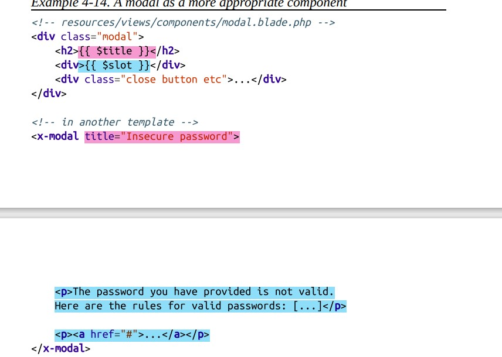

# Blade
- all blade syntax is compiled into normal php code then cached so it is fast

## now important question...
### he said here code will cashed how it is cashed even if i can update blade and see the result directly without clear cache?

Laravel also provides features for development environments that make it convenient to see changes in Blade templates without manually clearing the cache:

**Automatic Compilation**: In development mode, Laravel will automatically recompile Blade templates if changes are detected in the original .blade.php files. This means that when you make changes to a Blade template during development, Laravel will detect those changes and recompile the template without you needing to manually clear the cache.

**Cache Clearing**: In some cases, if you encounter issues with stale cache or if changes are not reflected as expected, you might need to manually clear the cache using artisan commands like `php artisan view:clear` or `php artisan cache:clear`. This command clears the compiled views cache, forcing Laravel to recompile the Blade templates on the next request.

So, while Blade templates are cached for performance, Laravel provides mechanisms to ensure that changes made during development are reflected in the rendered output without needing to manually clear the cache every time.

# not to use php in blade
- if you have to use php in blade that mean you use code must not be used in that file
- so you must go and write that code in the model or the controller

## Echoing data
- data is safe
```php
{{ $variable }}  == <?= htmlentities($variable) ?>
```
- to echo data without htmlentities
```php
 {!! and !!}
```

# notice the diffrence between two codes
```php
// Parsed as Blade; the value of $bladeVariable is echoed to the view
{{ $bladeVariable }}
// output: value of $bladeVariable

// @ is removed and "{{ handlebarsVariable }}" echoed to the view directly
@{{ handlebarsVariable }}
// output: {{ handlebarsVariable }}


```

# verbatim
- `@verbatim` is a helpful directive for ensuring that specific parts of your template are treated as raw text without any Blade processing
```php
@verbatim
    <div class="container">
        Hello, {{ name }}.
    </div>
@endverbatim
```

# forelse
- @forelse is a @foreach that also allows you to program in a fallback if the
object you’re iterating over is empty.
```php
@forelse ($talks as $talk)
    {{ $talk->title }} ({{ $talk->length }} minutes)<br>
@empty
    No talks this day.
@endforelse

```
# yield with default value
```php
@yield('title','Home page')
```

# foreach & forelse in blade system
- they add new feature not exists in php foreach loops: `$loop variable`
- that variable will return std class object, with those properties
    - index: 0-indexed
    - iteration: 1-indexed
    - remaining: number of element remain in loop
    - count: number of elemnt in loop
    - first & last: boolen indicate first or last
    - even & odd: boolen indicate whether that iteration is odd or even 
    - depth: How many “levels” deep this loop is: 1 for a loop, 2 for a loop
within a loop, etc.
    - parent: refrence to the parent of that loop, if that loop is in another loop, if not return null

# Template Inheritance
## @section...@show
```php
@section('footerScripts')
<script src="app.js"></script>
@show
```
1. `@show`: used to show that content in parent, if i don't use section use it as default in children classes
2. if child have content in section it will overwrite that current content
3. to make that content appear i must use `@parent` inside the section

### diffrence between show and endsection 
- `@show`: used to show that content in parent, if i don't use section use it as default in children classes

## @yeild & @section
- we use @yeild in parent to place a place for section
- @section...@endsection: used in children to put some content in the place of @yeild

```php
// parent
<html>
<head>
    <title>My Site | @yield('title', 'Home Page')</title>
</head>
<body>
    <div class="container">
        @yield('content')
    </div>
    @section('footerScripts')
        <script src="app.js"></script>
    @show
</body>
</html>
```

```php
// child
@extends('parent')
@section('title','child page')
@section('content')
    <p>loma</p>
@endsection

@section('footerScripts')
    @parent
    <script src="loma.js"></script>
@endsection
```
- @stop: it is only alias for @endsection
- @parent: it is used to incluede content in the parent to the child

# includeIf, includeWhen and includeFirst
```php
{{-- Include a view if it exists --}}
@includeIf('sidebars.admin', ['some' => 'data'])

{{-- Include a view if a passed variable is truth-y --}}
@includeWhen($user->isAdmin(), 'sidebars.admin', ['some' => 'data'])

{{-- Include the first view that exists from a given array of views --}}
@includeFirst(['customs.header', 'header'], ['some' => 'data'])
```
## @each
- loop over array $modules will call file('partials.module') if array impy call file partials.empty-module
```php
<!-- resources/views/sidebar.blade.php -->
<div class="sidebar">
    @each('partials.module', $modules, 'module', 'partials.empty-module')
</div>

<!-- resources/views/partials/module.blade.php -->
<div class="sidebar-module">
    <h1>{{ $module->title }}</h1>
</div>

<!-- resources/views/partials/empty-module.blade.php -->
<div class="sidebar-module">
    No modules :(
</div>
```

# components
- it is much easier to pass larage sections of template code into them

## create component for view only (only template)
```
php artisan make:component modal --view
```
## generate php class
```php
php artisan make:component modal 
```

## passing data to componnents
there are **4** ways to pass variables to view using component
1. string attribute
2. php attribute
3. default slot
4. named slot

### Passing data into components via attributes
1. **template only**
   ```php
    <!-- Passing the data in -->
    <x-modal title="Title here yay" :width="$width" />
    <!-- Accessing the data in the template -->
    <div style="width: {{ $width }}">
    <h1>{{ $title }}</h1>
    </div>
    // notice attrbutes('title', 'width')
   ```
2. **generate php class**
    1. define every attribute in component class and set its property to `public`
    ```php
    class Modal extends Component
    {
    public function __construct(
    public string $title,
    public string $width,
    ) {}
    }
    ```
    2. pass attributes while calling component view
    ```php
    public function render(): View|Closure|string
    {
        return view('components.nav',['title'=>title]);
    }
    ```

#### @props
- if i use variable $attributes any variable i define inside @props will not appear in $attributes if use it inside component
- i use it also to set default values
```php
@props([
    'width',
    'title',
])
<div style="width: {{ $width }}">
    <h1>{{ $title }}</h1>
</div>
```
```php
// components/modal.balde.php
@props([
    'width'=>0,
    'title'=>0,
])
<div style="width: {{ $width }}" $attributes> // that vaiable $attributes= ['class'=>'coco'] because attribute class not defined in @props
    <h1>{{ $title }}</h1>
</div>

// to use above
<x-modal width='0' title="loma" class= 'coco' />
```

### Passing data into components via slots
- you may have to use more than one slot, so you should use named slot
```php
// to use model
<x-modal>
<x-slot:title>
    <h2 class="uppercase">Password requirements not met</h2>
</x-slot>
    <p>The password you have provided is not valid.
    Here are the rules for valid passwords: [...]</p>
    <p><a href="#">...</a></p>
</x-modal>
```
```php
// that is in component/modal.blade.php
<div>
    {{ $title }}
    {{ $slot }}
<div>
```

## component method
- that function i use to not use php code inside plade, so i define function in component class to call it when i use inside component
```php
// inside component class
// define function isPromoted to can use it inside template and not to use php code in template
public function isPromoted($item)
{
    return $item->promoted_at !== null && ! $item->promoted_at->isPast();
}

<!-- in the template -->
<div>
@if ($isPromoted($item))
<!-- show promoted badge -->
@endif
<!-- ... -->
</div>
```

# stack
- we define stack as a placeholder in parent
- in the childs we push elements to that stack
- push/endpush: adds to the bottom
- prepend/endprepend: adds to the top
- styles will appear only in child i add styles to 
- that stack will be full in every child lonely

```php
<!-- resources/views/layouts/app.blade.php -->
<html>
<head><!-- the head --></head>
<body>
 <!-- the rest of the page -->
 <script src="/css/global.css"></script>
 <!-- the placeholder where stack content will be placed -->
 @stack('scripts')
</body>
</html>

<!-- resources/views/jobs.blade.php -->
@extends('layouts.app')
@push('scripts')
 <!-- push something to the bottom of the stack -->
 <script src="/css/jobs.css"></script>
@endpush

<!-- resources/views/jobs/apply.blade.php -->
@extends('jobs')
@prepend('scripts')
 <!-- push something to the top of the stack -->
 <script src="/css/jobs--apply.css"></script>
@endprepend

//These generate the following result:
<html>
<head><!-- the head --></head>
<body>
 <!-- the rest of the page -->
 <script src="/css/global.css"></script>
 <!-- the placeholder where stack content will be placed -->
 <script src="/css/jobs--apply.css"></script>
 <script src="/css/jobs.css"></script>
</body>
</html>
```

# components and slots
- slot work as a placeholder
```php
<!-- resources/views/partials/modal.blade.php -->
<div class="modal">
<div>{{ $slot }}</div>
 <div class="close button etc">...</div>
</div>

<!-- in another template -->
@component('partials.modal')
 <p>The password you have provided is not valid.
 Here are the rules for valid passwords: [...]</p>
 <p><a href="#">...</a></p>
@endcomponent
```
- that content in component('partials.modal') will be put in plase of $slot

- if i use slot with another name rather than $slot will call it like that 
```php
@slot('title')
.....
@endslot
```
- example contains both types 
```php
<!-- resources/views/partials/modal.blade.php -->
<div class="modal">
 <div class="modal-header">{{ $title }}</div>
 <div>{{ $slot }}</div>
 <div class="close button etc">...</div>
</div>

@component('partials.modal')

 // will be put in place of title
 @slot('title')
 Password validation failure
 @endslot

 // will be put in place of slot
 <p>The password you have provided is not valid.
 Here are the rules for valid passwords: [...]</p>
 <p><a href="#">...</a></p>
@endcomponen
```


# View Composers and Service Injection
- sometimes you find yourself passing the same data over and over to the multiple views
```php
Route::get('home', function () {
    return view('home')
        ->with('posts', Post::recent());
});
Route::get('about', function () {
    return view('about')
        ->with('posts', Post::recent());
});
```
*what is a bad thing :(* 
- the solution is called **view composer**, it allows you to share the same data over multible views you define

_we can solve that problem with many ways lets discuss each :"_

## 1. Sharing a variable globally (every view will have that variable)
*globally share variable to all views in application*
```php
// in app service provider as usual any thing we want over all app is put in it :"
public function boot()
{
    view()->share('recentPosts', Post::recent());
}
```

## 2. View-scoped view composers with closures
*define some views to pass variables to :"*
```php
view()->composer(
['partials.header', 'partials.footer'],
function ($view) {
$view->with('recentPosts', Post::recent());
}
);
```
## 3. View-scoped view composers with classes
*same as above but as usual any closure function can be replaced by class :"*
```php
namespace App\Http\ViewComposers;
use App\Post;
use Illuminate\Contracts\View\View;
class RecentPostsComposer
{
    public function compose(View $view)
    {
        $view->with('recentPosts', Post::recent());
    }
}
```
```php
public function boot(): void
{
    view()->composer(
        'partials.sidebar',
        \App\Http\ViewComposers\RecentPostsComposer::class // instead of passing closure function pass calss i created :"
    );
}
```

# Blade service injection
- i pass object of a class of a serivice to can use its variables and methods in the view page, and not have to pass it to each route
- i inject that service using directive `@inject`

```php
@inject('analytics', 'App\Services\Analytics')
<div class="finances-display">
    {{ $analytics->getBalance() }} / {{ $analytics->getBudget() }}
</div>
```

# Custom Blade Directives
- there is alot of builtin directives in laravel which you can use it, but you can also make you own directive :"
- directives are good to reduce redundancy of code, make code more simple
- *now how to make it :"*
```php
public function boot()
{
    Blade::directive('ifGuest', function () {
        return "<?php if (auth()->guest()): ?>";
    });
}
```
## you can also pass parameters to directives
```php
// Binding
Blade::directive('newlinesToBr', function ($expression) {
    return "<?php echo nl2br({$expression}); ?>";
});
// In use
<p>@newlinesToBr($message->body)</p>
```
## if directive is made for if statment
- you can write that as that:
```php
Blade::if('ifPublic', function () {
    return (app('context'))->isPublic();
});
```
- instead of that 
```php
Blade::directive('ifGuest', function () {
    return "<?php if (auth()->guest()): ?>";
});
```

# cache and blade directives
- it is not a good practice to use directives in providers if it contains variables because of caching, if you have variables they will be compiled cached and stored in `storage/framework/views` and it will not updates it's values until you make update to your code in the template (they will store only the value of these varible) like that `if(1)` not `if($isGuest)`

- if there is no updates i made to my blade laravel will go always and run that cashed file, so always notice how your code is cashed :"

- notice those for more clarification :"

```php
// code inside loma.blade.php

@ifGuest
{{ 'welcome loma:"' }}
@endif
<div class="container">
    Hello, {{ 'coco' }}.
</div>
```

## problem :(
```php
// code inside service proider

Blade::directive('ifGuest', function () {
// Antipattern! Do not copy.
$ifGuest = auth()->guest();
return "<?php if ({$ifGuest}): ?>";
});
```
- cashed code
```php
<?php if (1): ?> // notice that @ifGuest store as if (1) static value:"
<?php echo e('welcome loma:"'); ?>

<?php endif; ?>

<div class="container">
    Hello, <?php echo e('coco'); ?>.
</div>
<?php /**PATH C:\xampp\htdocs\laravel\practice\resources\views/loma.blade.php ENDPATH**/ ?>
```
**the problem here now what if the user login, will the app notice that?**
*no it won't notice :(*

## to solve it :)
- update code in service provider
```php
// code inside service proider

Blade::directive('ifGuest', function () {
    // Antipattern! Do not copy.
    return "<?php if (auth()->guest()): ?>";
});
```
- cashed code
```php
<?php if (auth()->guest()): ?>
<?php echo e('welcome loma:" '); ?>

<?php endif; ?>

<div class="container">
    Hello, <?php echo e('coco'); ?>.
</div>
<?php /**PATH C:\xampp\htdocs\laravel\practice\resources\views/loma.blade.php ENDPATH**/ ?>
```