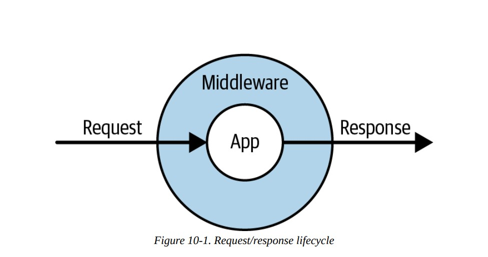
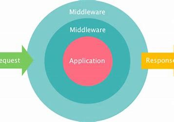
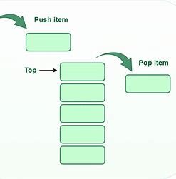

# chapter 10 (Requests, Responses, and Middleware)
```text
We always treat with requests, responses and middleware
in every request 
that is so important chapter 
let's learn it
```
## Laravel’s Request Lifecycle
- any request in laravel, either made by HTTP request or command line integration 
is immediately converted into illuminate request object
- request pass through many layers (middlewares) before it reaches app itself (controller)

- every request pass through .htaccess before it reaches app
- .htaccess have some configurations like handling authentication
- it capture every request and route it to public/index.php
### index.php 
1. load autoloader which load all dependencies
2. kick off laravel bootstrap => create application containers
3. create an instance of its kernel, which create request and pass request to kernel to handle response object
4. pass response to client, kernel terminate page request
```php
define('LARAVEL_START', microtime(true));

/*
|--------------------------------------------------------------------------
| Check If The Application Is Under Maintenance
|--------------------------------------------------------------------------
|
| If the application is in maintenance / demo mode via the "down" command
| we will load this file so that any pre-rendered content can be shown
| instead of starting the framework, which could cause an exception.
|
*/

if (file_exists($maintenance = __DIR__.'/../storage/framework/maintenance.php')) {
    require $maintenance;
}

/*
|--------------------------------------------------------------------------
| Register The Auto Loader
|--------------------------------------------------------------------------
|
| Composer provides a convenient, automatically generated class loader for
| this application. We just need to utilize it! We'll simply require it
| into the script here so we don't need to manually load our classes.
|
*/

require __DIR__.'/../vendor/autoload.php';

/*
|--------------------------------------------------------------------------
| Run The Application
|--------------------------------------------------------------------------
|
| Once we have the application, we can handle the incoming request using
| the application's HTTP kernel. Then, we will send the response back
| to this client's browser, allowing them to enjoy our application.
|
*/

$app = require_once __DIR__.'/../bootstrap/app.php';

$kernel = $app->make(Kernel::class);

$response = $kernel->handle(
    $request = Request::capture()
)->send();

$kernel->terminate($request, $response);
```
### kernel
- core router of laravel application
- take user request
- process it through middleware
- handle exceptions
- return response

### there two kernels and two types of request
- each kernel is responsible for handling one type of request
- kernel for HTTP request
- kernel for CLI request

### service provider
- encapsulates logic that various parts of your application need to run to bootstrap their core functionality
- first all register functions of all service providers are called
- then boot functions of all service providers are called

## The Request Object
- Illuminate\Http\Request is an extension of Symfony’s HttpFoundation\Request
- in native php you use $_SERVER, $_GET, $_POST to get information about the current user's request 
- those are very hard to understand and i have to write a lot of code 
- to get instance of $request object i can user `app()` like that
```php
$request = app(Illuminate\Http\Request::class);
$request = app('request');
```
### request methods
```text
we can divide them into many categories
```
1. **Basic user input**
   - input submitted by user through form
   - get user input and any related information 
2. **User and request state**
   - input not submitted by user
   - `method()` returns HTTP method used (get, post, batch, ...)
   - `path()` return bath without domain
   - `url()` url with domain
   - `is()` search if current url contains specific regex
   - `ip()` return ip address
   - `header()` returns array of headers
   - `server()`
   - `secure()` if uses HTTPs or not
3. **Files**
   - file, allFiles, hasFile
4. **Persistence**
   - interacting with session
   - `flash()` save current request to session but disappear after passing to the next request
   - `old()` returns values that was previously flashed
   - `cookie()`
   - flash and old are most usage when the user input is validated or prevented

## The response object
- any response returned from route definition will be parsed into response your user's browser can parse
- i can add cookies or headers to response 
```php
Route::get('route', function () {
    return new Illuminate\Http\Response('Hello!');
});

// Same, using global function:
Route::get('route', function () {
    return response('Hello!');
});

Route::get('route', function () {
    return response('Error!', 400)
        ->header('X-Header-Name', 'header-value')
        ->cookie('cookie-name', 'cookie-value');
    });
```

## Specialized Response Types
- There are also a few special response types for views, downloads, files, and JSON
### View responses
```php
Route::get('/', function (XmlGetterService $xml) {
    $data = $xml->get();
    return response()
           ->view('xml-structure', $data)
           ->header('Content-Type', 'text/xml');
});
```

### Download responses
- that file is stored in database or protected location
### File responses
- display the file
```php
public function invoice($id)
{
    return response()->file("./invoices/{$id}.pdf", ['header' =>
    'value']);
}
```
```php
Route::get('/', function () {
    return response()
           ->download('file.zip');
});
```
## Custom response macros
- make modification to your own response and modification provided content
```php
class AppServiceProvider
{
public function boot()
{
    Response::macro('myJson', function ($content) {
        return response(json_encode($content))
        ->withHeaders(['Content-Type' =>
        'application/json']);
    });
}

// during usage
return response()->myJson(['name' => 'Sangeetha']);
```
## Laravel and Middleware
### An Introduction to Middleware
```text
Middleware is like multi layers of cake
which are surrounded the application 
every request or response must pass all those layers of middleware before it reaches application, or end user
```
- separate from logic of application
- middlewares must be designed to can serve all apps not only the one you are currently work on
- prevent threshold, many attempts of request in the last minute, when that gone middleware return 429
- open and close of sessions, middlewares are perfect for that because it is the first and last thing in request/response life cycle,
php need us to open session very early and close it very lately

### Creating Custom Middleware
```text
Let's imagine new CR to an app
the client request to prevent all delete actions in the whole app
Now i can go to route and search for any delete action in the route, and remove it,
oh, what is a bad idea

Middleware is perfect for that, So Let's create middleware that prevent any DELETE HTTP request 
```
- create middleware: `php artisan make:middleware BanDeleteMethod`
- now when i open folder i see that 
```php
class BanDeleteMethod
{
    public function handle($request, Closure $next)
    {
        return $next($request);
    }
}
```
### let's study handle method
- that `$next` add every middleware to stack and pass request to next handle method of the next middleware, until it finish all layers and reach the app


- after request pass and all middleware finish, it will reach app
- after that response want to out and return to client
- middleware come again and add all required cookies to that response
- response out using algorithms of LIFO of the stack

### Binding Middleware
```text
Now i create middleware, but can't use it yet
i must register it
where to do that?

we don that in the `app/Http/Kernel.php`
```
- middleware can be registered globally or for specific route
#### binding middleware globally
- add it to $middleware property of `app/Http/Kernel.php`
```php
// app/Http/Kernel.php
protected $middleware = [
    \App\Http\Middleware\TrustProxies::class,
    \Illuminate\Foundation\Http\Middleware\CheckForMaintenanceMode::class,
    \App\Http\Middleware\BanDeleteMethod::class,
];
```
#### Binding route middleware
- use names you define using aliases
```php
Route::get('contacts', [ContactController::class, 'index'])-
>middleware('ban-delete');
```

### Using middleware groups
- there is by default to route middleware groups in laravel (web and api)
- how routes in web.php know the middleware group it belongs to?
  - middleware groups are bind to that route in `RouteServiceProvider.php`
```php
    public function boot(): void
    {
        RateLimiter::for('api', function (Request $request) {
            return Limit::perMinute(60)->by($request->user()?->id ?: $request->ip());
        });

        if(config('global.should_use_api_key_middleware')) {
            array_push($this->apiMiddlewares, 'apikey');
        }
        $this->routes(function () {
            Route::middleware($this->apiMiddlewares)
                ->namespace($this->apiClientNamespace)
                ->prefix('client-api/v1')
                ->group(base_path('routes/api-v1.php'));

            Route::middleware('web')
                ->namespace($this->namespace)
                ->group(base_path('routes/web.php'));
        });
    }
```